# Architecture Design

## System Architecture

The system will be a modular Flask application using the Application Factory pattern. It will expose server-rendered pages through Jinja2 templates and JSON endpoints for dynamic frontend interactions using Fetch API.

Primary layers:

1. Presentation Layer
   - Jinja2 templates
   - Bootstrap 5
   - JavaScript ES6

2. API Layer
   - Flask Blueprints
   - Marshmallow schemas
   - JSON responses

3. Service Layer
   - Business rules
   - Validations
   - Calculations
   - Audit orchestration

4. Repository Layer
   - SQLAlchemy query abstraction
   - Persistence operations

5. Domain Model
   - SQLAlchemy models
   - Shared mixins for timestamps and soft delete

6. Infrastructure
   - SQLite for development
   - PostgreSQL for production
   - Flask-Migrate
   - Docker and Docker Compose

## Domain Model

Core entities:

1. Company
2. Branch
3. Department
4. User
5. Employee
6. Area
7. Task
8. TimeRecord
9. AuditLog

Future-ready entities:
- Company supports multi-company.
- Branch supports multi-location.
- Department supports organizational growth.

## Database Design

All business tables must include:
- `id`
- `created_at`
- `updated_at`
- `deleted_at`
- `created_by`
- `updated_by`
- `deleted_by`

Soft-deleted records must be excluded from normal application queries.

## ER Diagram

```mermaid
erDiagram
    COMPANY ||--o{ BRANCH : has
    COMPANY ||--o{ DEPARTMENT : has
    COMPANY ||--o{ USER : owns
    COMPANY ||--o{ EMPLOYEE : employs
    COMPANY ||--o{ AREA : defines
    BRANCH ||--o{ EMPLOYEE : assigns
    DEPARTMENT ||--o{ EMPLOYEE : groups
    USER ||--o| EMPLOYEE : linked_to
    AREA ||--o{ TASK : contains
    EMPLOYEE ||--o{ TIME_RECORD : logs
    AREA ||--o{ TIME_RECORD : classified_by
    TASK ||--o{ TIME_RECORD : classified_by
    USER ||--o{ AUDIT_LOG : performs

    COMPANY {
        int id PK
        string name
        bool active
        datetime created_at
        datetime updated_at
        datetime deleted_at
    }

    BRANCH {
        int id PK
        int company_id FK
        string name
        bool active
    }

    DEPARTMENT {
        int id PK
        int company_id FK
        string name
        bool active
    }

    USER {
        int id PK
        int company_id FK
        string username
        string email
        string password_hash
        string role
        bool is_active
    }

    EMPLOYEE {
        int id PK
        int company_id FK
        int branch_id FK
        int department_id FK
        int user_id FK
        string first_name
        string last_name
        string document_number
        string email
        string phone
        string position
        date hire_date
        bool active
    }

    AREA {
        int id PK
        int company_id FK
        string name
        string description
        bool active
    }

    TASK {
        int id PK
        int area_id FK
        string name
        string description
        bool active
    }

    TIME_RECORD {
        int id PK
        int employee_id FK
        int area_id FK
        int task_id FK
        date record_date
        time start_time
        time end_time
        numeric hours
        text observations
    }

    AUDIT_LOG {
        int id PK
        int user_id FK
        string action
        string table_name
        int record_id
        json previous_values
        json new_values
        string ip_address
        string user_agent
        datetime created_at
    }
```



## Security Design

1. Passwords stored with Werkzeug password hashing.
2. Flask-Login for session authentication.
3. Flask-WTF CSRF protection for forms.
4. Marshmallow validation for API payloads.
5. SQLAlchemy ORM for SQL injection prevention.
6. Jinja2 autoescaping for XSS protection.
7. RBAC decorators for protected routes.
8. Secure cookie configuration by environment.
9. Audit log for sensitive actions.
10. No physical deletion for business records.

## Audit Design

Every meaningful operation writes an `AuditLog`:

Actions:
- CREATE
- UPDATE
- DELETE
- LOGIN
- LOGOUT
- EXPORT
- PASSWORD_CHANGE

Audit fields:
- `user_id`
- `action`
- `table_name`
- `record_id`
- `previous_values`
- `new_values`
- `ip_address`
- `user_agent`
- `created_at`

## Deployment Architecture

Development:
- Flask app
- SQLite
- Local filesystem

Production:
- Gunicorn
- PostgreSQL
- Docker Compose
- Environment variables
- Reverse proxy compatible

## Folder Structure

```text
app/
  __init__.py
  config.py
  extensions.py
  auth/
  users/
  employees/
  areas/
  tasks/
  time_records/
  reports/
  dashboard/
  audit/
  models/
  services/
  repositories/
  forms/
  permissions/
  middleware/
  utils/
  api/
  templates/
  static/
migrations/
tests/
scripts/
docs/
requirements.txt
Dockerfile
docker-compose.yml
.env.example
README.md
```
