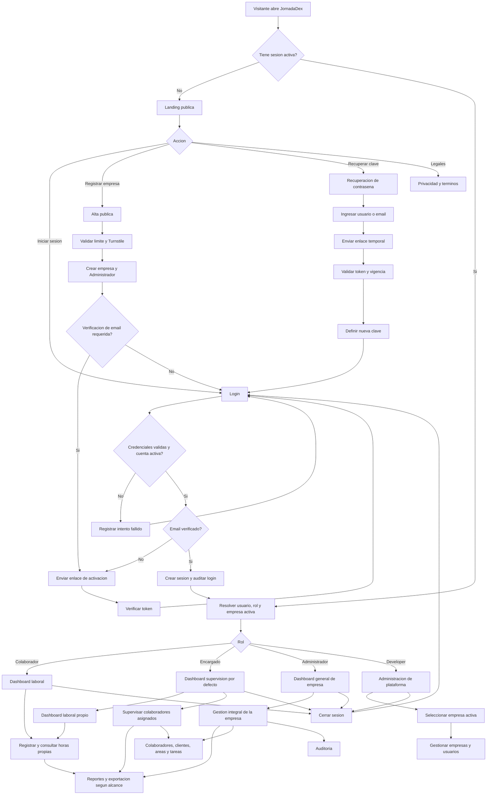
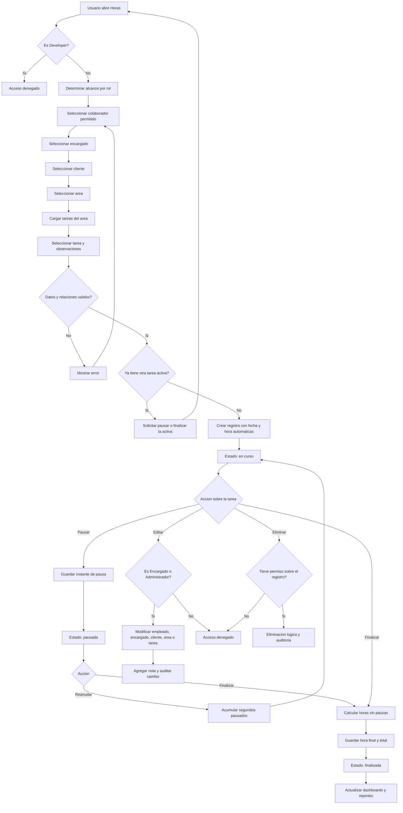
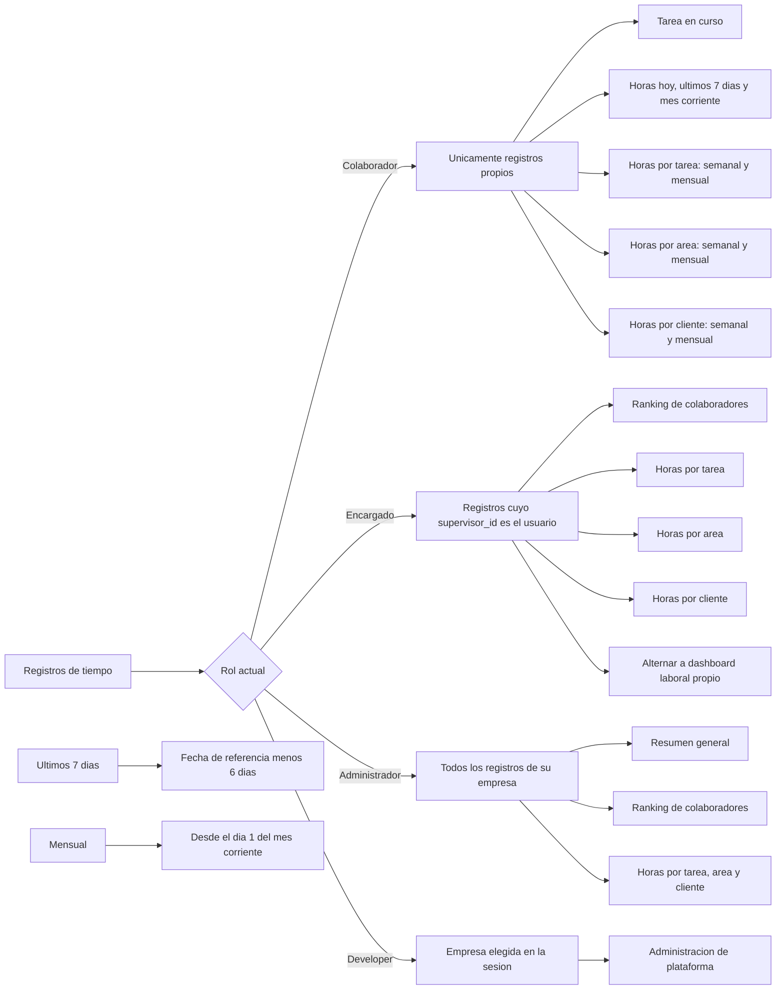
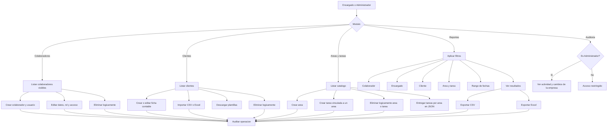
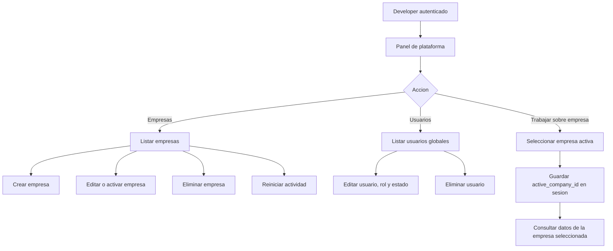
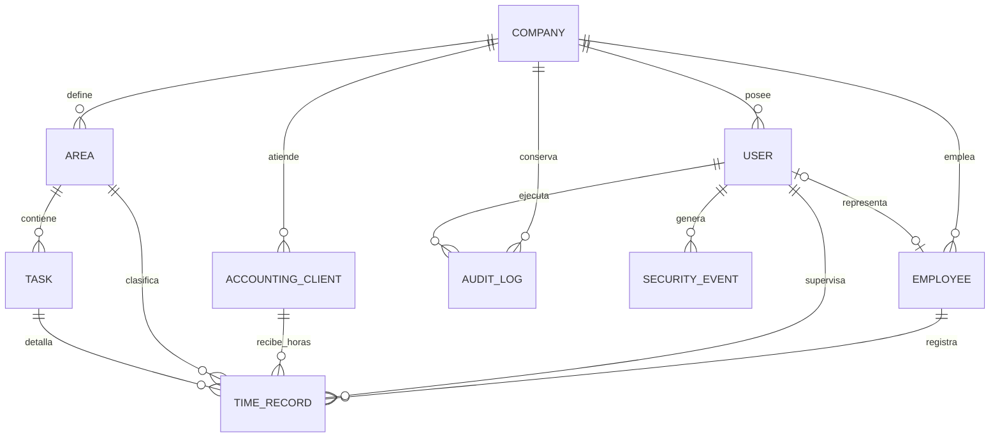

# Diagrama de flujo completo de JornadaDex

Este documento representa el comportamiento actual de la aplicacion, sus roles y los principales procesos de negocio.

## Flujo general

## Registro de horas

## Dashboards y visibilidad

## Gestion de la empresa

## Administracion de plataforma

## Relaciones principales de datos

## Rutas principales

| Modulo              | Ruta base         | Acceso                                                    |
| ------------------- | ----------------- | --------------------------------------------------------- |
| Landing y dashboard | `/`, `/dashboard` | Publico / autenticado                                     |
| Autenticacion       | `/auth`           | Publico y autenticado para logout                         |
| Horas               | `/time-records`   | Usuarios de empresa                                       |
| Colaboradores       | `/employees`      | Encargado y Administrador                                 |
| Clientes            | `/clients`        | Encargado y Administrador                                 |
| Areas y tareas      | `/areas`          | Lectura autenticada; gestion de Encargado y Administrador |
| Reportes            | `/reports`        | Autenticado, limitado por visibilidad                     |
| Auditoria           | `/audit`          | Administrador                                             |
| Plataforma          | `/platform`       | Developer                                                 |
